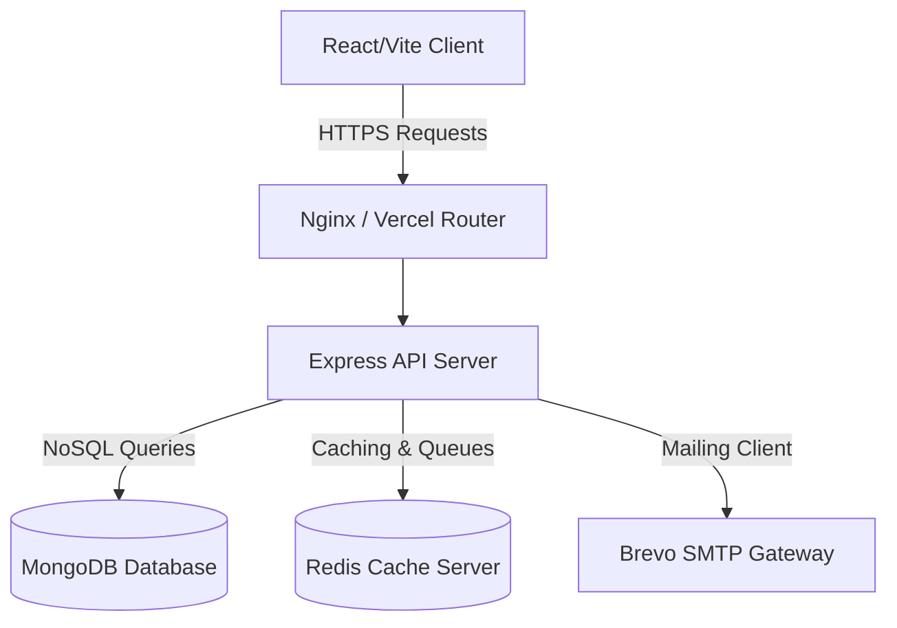
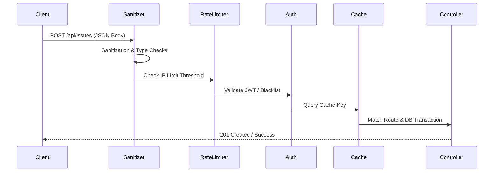

# FixNearby Architecture Documentation

This document describes the high-level system architecture, service components, background workers, and internal data processing patterns of the FixNearby application.

---

## 🏗️ System Overview

FixNearby is designed using a decoupled client-server model to ensure independent scaling, modular development, and separation of concerns.

### Key Service Layers
1. **Frontend (Client)**: A fast React single-page application built using Vite, styled using Tailwind CSS, and containing page components with route-based lazy loading.
2. **Backend (Server)**: An Express.js REST API providing routing, controllers, input validation middleware, secure token authentication, and data models.
3. **Mailing Service**: External transaction email delivery configured using the Brevo SMTP SDK.
4. **Queue & Background Workers**: Redis-backed BullMQ message queues managing background notifications, retry strategies, and dead-letter log storage.

---

## 🚦 Request Processing Pipeline

Every incoming request to the server passes through the following secure pipeline stages before reaching the controller logic:

---

## 📈 Background Processing Engines

### 1. Weekly Karma & Trust Engine
The reliability of service workers is determined dynamically using the Weekly Karma Scheduler.
- **Weights Applied**:
  - **Completion Rate (40%)**: Ratio of `Completed` status bookings versus `Cancelled` status bookings.
  - **Review Rating (40%)**: Average rating of all reviews submitted for completed bookings.
  - **Responsiveness (20%)**: Initial responsiveness score recorded in the worker database profile.
- **Workflow**:
  - Automatically runs as a weekly cron job via `node-cron`.
  - Can be manually triggered by administrators/operators through a secure POST request to `/api/workers/recalculate-karma`.

### 2. Notification Worker & Dead-Letter Queue
To prevent blocking main thread processes, all outgoing notifications (Welcome emails, Booking confirmations, Status updates) are offloaded to a background queue.
- **Tech Stack**: BullMQ backed by a Redis connection.
- **Retry Mechanism**: Employs an exponential retry backoff strategy.
- **Dead-Letter Storage**: If a notification job fails repeatedly and exhausts its retry limit, the worker captures the error stack trace and logs a document inside the `DeadLetterJob` MongoDB collection for developer inspection.
