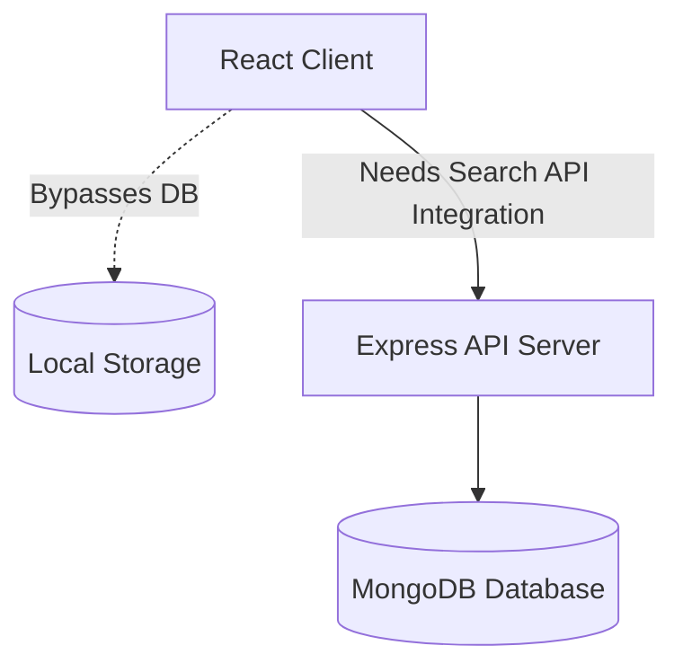

# FixNearby Open Source Contributor Roadmap 🚀

Welcome to the **FixNearby Contributor Roadmap**! Whether you are a first-time open-source contributor or an experienced full-stack developer, this guide will help you understand the architecture, identify the key technical gaps in our codebase, and find exciting features to work on.

---

## 🏗️ 1. Subsystem Architecture Summaries

FixNearby is built on a modern MERN stack. Below is a breakdown of our three core subsystems:

### ⚙️ Backend (API Server)
* **Framework & Database:** Node.js, Express.js, and MongoDB.
* **Geospatial Engine:** Uses Mongoose schemas with GeoJSON `Point` types and MongoDB `2dsphere` indexing to perform precise spatial queries.
* **Security & Auth:** Employs JWT (JSON Web Tokens) with a custom blacklisting middleware (`server/middleware/authMiddleware.js`) that persists revoked tokens in MongoDB on user logout. It is secured with `helmet`, `cors`, and `express-rate-limit`.
* **Booking Engine:** Features transactional booking validation in `server/controllers/bookingController.js` using Mongoose database sessions to prevent double-booking conflicts.

### 💻 Frontend (Client App)
* **Framework:** React 18, Vite, React Router v6, and Tailwind CSS.
* **Localization:** Internationalization is powered by `i18next` (`client/src/i18n/index.js`), supporting language switching for headers, forms, and pages.
* **State Management:** Currently relies on local component state, standard hooks, and a local storage sync for session persistence.

### 📈 Background Schedulers & Workers
* **Notification Queue:** Powered by Redis and BullMQ (`server/workers/notificationWorker.js`). Outgoing welcome emails and transactional updates are queued, retried with exponential backoff, and logged to a Mongoose `DeadLetterJob` collection on terminal failure.
* **Weekly Karma Cron:** A scheduler (`server/utils/karmaScheduler.js`) utilizing `node-cron` that runs weekly to recalculate each worker's trust/reliability rating (Karma score) based on completion rates (40%), average review ratings (40%), and responsiveness (20%).
* **Booking Expiry Scheduler:** A background interval runner (`server/workers/bookingExpiryWorker.js`) that checks for expired pending bookings every 60 seconds and marks them as cancelled.

---

## 🚦 2. Major Integration Gaps (What Needs Refactoring)

Currently, some frontend pages do not communicate with the backend. These present perfect opportunities for contributors:

### 🔍 A. Worker Search & Filtering Bypass
* **Current State:** The backend has `GET /api/workers/nearby` (aggregating `$geoNear` spatial results) and `GET /api/search` (general keyword lookup). However, the frontend (`client/src/pages/Services.jsx`) fetches *all* workers via `GET /api/workers` and handles searching, categorization, and sorting purely in-memory.
* **The Bug:** Advanced filters in the filter sidebar (min/max price, rating, max distance, availability) do not filter anything on the screen.
* **Expectation:** Refactor `Services.jsx` to query backend endpoints dynamically, utilizing database-level filtering and geospatial range matching.

### 📅 B. Bookings Flow Bypass
* **Current State:** Although the backend has robust, transactional booking controllers, the frontend (`client/src/pages/WorkerProfile.jsx` and `client/src/pages/Bookings.jsx`) writes and reads booking records entirely to/from browser `localStorage`.
* **Expectation:** Replace all `localStorage` booking methods with real API calls to `POST /api/bookings` and `GET /api/bookings`, adding loading states and transaction confirmations.

### 📣 C. The Orphan Civic Issue Form
* **Current State:** The frontend has an advanced `IssueSubmissionForm.jsx` (with live geolocation tracking and automatic duplicate checks using spatial cached bounds). However, this form is **not imported or routed anywhere** on the client, rendering it inaccessible to the user.
* **Expectation:** Integrate this form into a user page (e.g., a new Civic Reporting Dashboard) and connect it to the corresponding backend `issueController`.

---

## 🎯 3. Feature Wishlist & Contributor Tasks

We have classified our feature wishlist into three categories:

### 🟢 Good First Issues (Beginner-Friendly)
* **Toast & Notification Feedbacks:** Audit static form submissions (e.g., Worker Registration, User Profile edits) and add interactive success/error toast alerts using `react-hot-toast`.
* **UI Clean-up & Skeleton Loading:** Replace raw text loading elements on page transitions with sleek Tailwind CSS skeleton loaders (`client/src/components/SkeletonLoader.jsx`).
* **Profile Validation UI:** Add inline regex validation warnings to inputs like phone numbers and postal codes on the register pages.

### 🟡 Intermediate Features (Full-Stack Integrations)
* **Real Bookings Integration:** Integrate the React booking calendars with the backend database. Ensure client bookings write to MongoDB instead of local storage.
* **Civic Issues Portal:** Create a dedicated page for Civic Reporting. Mount the `IssueSubmissionForm` here, showing an interactive list of active neighborhood reports, complete with sorting by upvotes and categories.
* **Dynamic Reviews & Feedback:** Connect the worker review tab to the backend `Review` endpoints. Recalculate average ratings and display sentiment badges (`SentimentBadge.jsx`) dynamically using database-calculated scores.

### 🔴 Advanced & Scalability Features (System Architecture)
* **Real-Time Live Chat:** Implement a Socket.io server to allow users to text-message service workers directly about bookings, sharing coordinates and pricing estimates.
* **Interactive Map Overlay:** Integrate Mapbox or Leaflet on `/services` to show worker locations dynamically on a map widget with custom markers and boundary radius overlays.
* **SMTP Provider Connection:** Replace the sandbox mock SMTP credentials in `server/services/mailService.js` with a fully validated SMTP connection to Brevo, utilizing responsive HTML transactional templates.
* **BullMQ Expiry Worker:** Refactor `bookingExpiryWorker.js` from a simple node process `setInterval` loop to a scheduled BullMQ repeating job for better cluster safety and retry handling.

---

## 🤝 4. Code Standards & Pull Request Guidelines

To ensure code quality and consistency, contributors must adhere to these rules:

1. **Branch Naming Conventions:**
   * Features: `feature/short-desc`
   * Bug Fixes: `fix/short-desc`
   * Refactoring: `refactor/short-desc`
   * Documentation: `docs/short-desc`

2. **Commit Hygiene:**
   * Commit messages must follow the [Conventional Commits](https://www.conventionalcommits.org/) specification (e.g., `feat(auth): add JWT refresh tokens`, `fix(services): correct sidebar rating filter`).
   * Write commits in the present tense ("Add search filter" not "Added search filter").

3. **Code Quality:**
   * Keep components modular and single-responsibility.
   * Do not write hardcoded URLs or connection strings. Use `import.meta.env` for client-side environment configurations, and `process.env` for the backend.
   * Preserve all existing comments and documentation patterns unless specifically refactoring them.

4. **Pull Request Checklist:**
   * Before pushing, run `npm run build` locally in the `client` folder to verify that your code builds without Rollup or Vite errors.
   * Provide a short description and/or screenshots showing your UI changes in action.
   * Reference the related GitHub issue using keywords (e.g. `Closes #42`).
